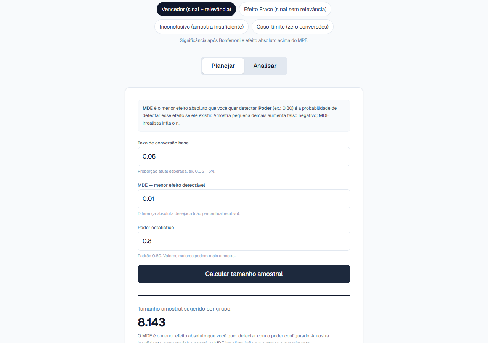
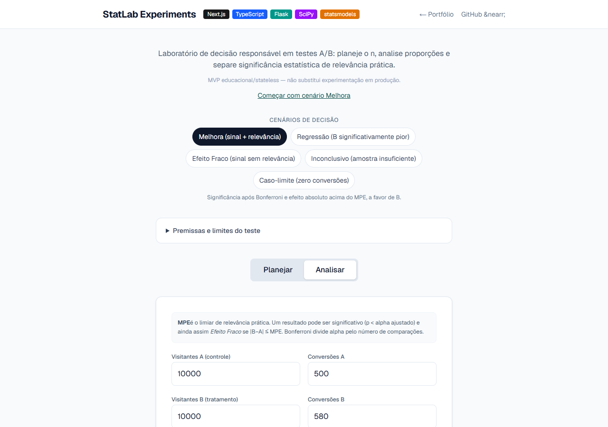
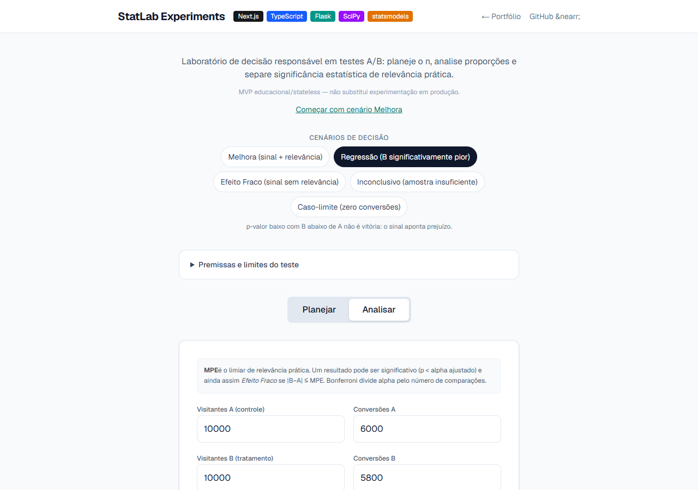
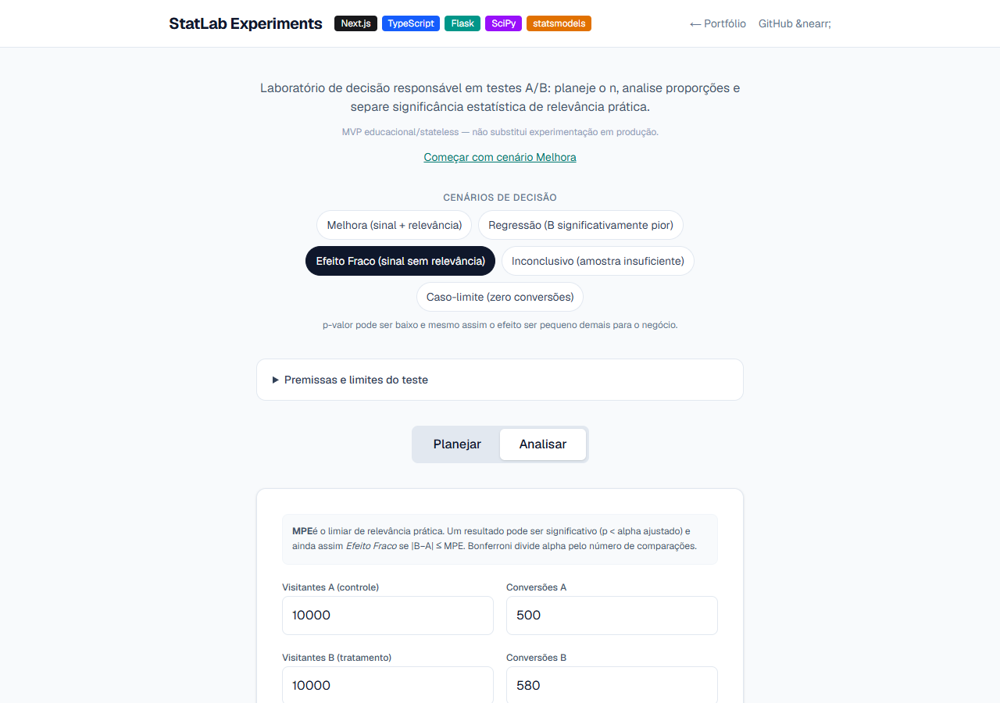

<div align="center">
  

  <h1>StatLab Experiments</h1>

  <p><strong>Planeje e interprete testes A/B com z-test, Bonferroni e motor de decisão em 4 estados com direção do efeito.</strong></p>
  <p><strong>Plan and interpret A/B tests with z-test, Bonferroni and a 4-state decision engine with signed effect direction.</strong></p>

  <p>
    <a href="#pt-br">PT-BR</a>
     · 
    <a href="#english">English</a>
     · 
    <a href="#live-demo">Live Demo</a>
     · 
    <a href="#stack">Stack</a>
     · 
    <a href="#architecture">Architecture</a>
     · 
    <a href="#quick-start">Quick Start</a>
     · 
    <a href="#author">Author</a>
  </p>

  <p>
    
    
    
    
    
  </p>

  <p>
    <a href="https://statlab-ab.vercel.app"><strong>Live Demo</strong></a>
     · 
    <a href="https://github.com/BarujaFe1/StatLab-Experiments"><strong>Repo</strong></a>
     · 
    <a href="https://barujafe.vercel.app/"><strong>Portfolio</strong></a>
     · 
    <a href="https://www.linkedin.com/in/barujafe/"><strong>LinkedIn</strong></a>
  </p>
</div>


> **Stats lab notice:** frequentist helpers for **two-proportion** experiments. Decision states (Melhora / Regressão / Efeito Fraco / Inconclusivo) are **pedagogical decision-support** — not automatic product rollout authority.

---

## PT-BR

### Visão geral
O **StatLab Experiments** calcula tamanho amostral (Cohen's *h* + poder), analisa duas proporções (z-test) e classifica o resultado em **Melhora / Regressão / Efeito Fraco / Inconclusivo** — com direção do efeito assinada (diff = pB − pA), correção de Bonferroni e IC de Newcombe no nível ajustado.

### Problema
Times leem A/B só pelo p-valor, param cedo e tratam qualquer “significativo” como vitória operacional — sem poder, tamanho de efeito nem relevância prática.

### Para quem
PMs, analistas e data scientists que precisam de um cockpit simples de **planejamento + interpretação** frequentista.

### Funcionalidades
- Planejamento de tamanho amostral (baseline, MDE absoluto, poder e alpha)
- Análise de duas proporções (z-test) via API Flask + SciPy/statsmodels
- Motor de decisão em 4 estados com direção do efeito (pB − pA vs MPE)
- IC de Newcombe coerente com Bonferroni (a UI mostra o nível real, ex.: IC 98,33%)
- Contratos honestos: p-valor null em casos degenerados, uplift null com baseline zero, 400 estruturado para entradas inválidas
- Cenários/chips de demonstração na UI Next.js
- `start.bat` para subir o lab no Windows

### Escopo e limites (honestos)
- Foco em **proporções / A/B binário** — não é suite completa de experimentação
- Não substitui design de experimento, SRM checks nem sequential testing avançado
- Decisão do motor é apoio — rollout continua humano

---

## English

### Overview
**StatLab Experiments** plans sample size (Cohen's *h* + power), analyzes two proportions (z-test) and classifies outcomes as **Melhora / Regressão / Efeito Fraco / Inconclusivo** — with signed effect direction (diff = pB − pA), Bonferroni correction and a Newcombe CI at the adjusted level.

### Problem
Teams read A/B tests from p-values alone, stop early and treat any “significant” result as an operational win — without power, effect size or practical relevance.

### Who it is for
PMs, analysts and data scientists who need a simple **plan + interpret** frequentist cockpit.

### Features
- Sample-size planning (baseline, absolute MDE, power and alpha)
- Two-proportion analysis (z-test) via Flask API + SciPy/statsmodels
- 4-state decision engine with signed effect direction (pB − pA vs MPE)
- Newcombe CI coherent with Bonferroni (UI shows the real level, e.g. 98.33%)
- Honest contracts: null p-value on degenerate counts, null uplift on zero baseline, structured 400s for invalid input
- Demo scenarios/chips in the Next.js UI
- Windows `start.bat` for local lab bring-up

### Scope and honest limits
- Focused on **binary A/B proportions** — not a full experimentation suite
- Does not replace experiment design, SRM checks or advanced sequential testing
- Engine output is support — humans still own rollout

---

## Live Demo

| Surface | URL |
|---|---|
| **Public lab** | [https://statlab-ab.vercel.app](https://statlab-ab.vercel.app) |
| **GitHub** | see Repo badge above |

**How to try:** plan a sample size → analyze a scenario → compare Melhora vs Regressão / Weak Effect / Inconclusive → read why the state was chosen (direction, adjusted alpha, real CI level).


## Screenshots

<table>
  <tr>
    <td width="50%"><br /><sub><strong>Plan sample size</strong></sub></td>
    <td width="50%"><br /><sub><strong>Analyze — Melhora</strong></sub></td>
  </tr>
  <tr>
    <td width="50%"><br /><sub><strong>Analyze — Regressão</strong></sub></td>
    <td width="50%"><br /><sub><strong>Weak effect</strong></sub></td>
  </tr>
</table>


## Stack

| Layer | Technology |
|---|---|
| Web | Next.js 16, React, TypeScript, Tailwind, Recharts |
| API | Flask (WSGI on Vercel), NumPy, SciPy, statsmodels |

---

## Architecture

```txt
frontend/      Next.js UI
api-server/    Flask handlers (`api/index.py`) + tests
docs/          demo script + screenshots
start.bat      local launcher
```

---

## Quick Start

```bash
.\start.bat
```

Manual:

```bash
# API
cd api-server
pip install -r requirements.txt
# run as documented / Vercel-style handler locally

# Web
cd frontend
npm install
npm run dev
```

---

## Technical decisions

- **4-state engine with signed direction** — a significantly *worse* B is Regressão, never a win (the historical `abs(diff)` bug is locked out by golden test G3)
- **Newcombe CI at the Bonferroni-adjusted level** — inference and interval are family-wise coherent; the UI shows the real level (e.g. 98.33%)
- **Honest edge contracts** — no fabricated p-values or uplifts; structured 400s for invalid input
- **Flask on Vercel** for a slim stats endpoint next to Next.js
- Teach **Bonferroni / power / direction** instead of p-value-only screenshots

Statistical methodology and assumptions: [`docs/STATISTICAL_METHOD.md`](./docs/STATISTICAL_METHOD.md).

---

## Roadmap

- More educational scenarios and guardrails (SRM messaging)
- Exportable analysis memo
- Broader test families beyond two proportions

---

## Author

**Felipe Alirio Baruja** — data / product / full-stack portfolio.

- Portfolio: [https://barujafe.vercel.app/](https://barujafe.vercel.app/)
- GitHub: [https://github.com/BarujaFe1](https://github.com/BarujaFe1)
- LinkedIn: [https://www.linkedin.com/in/barujafe/](https://www.linkedin.com/in/barujafe/)


## License

MIT — see [`LICENSE`](./LICENSE).
