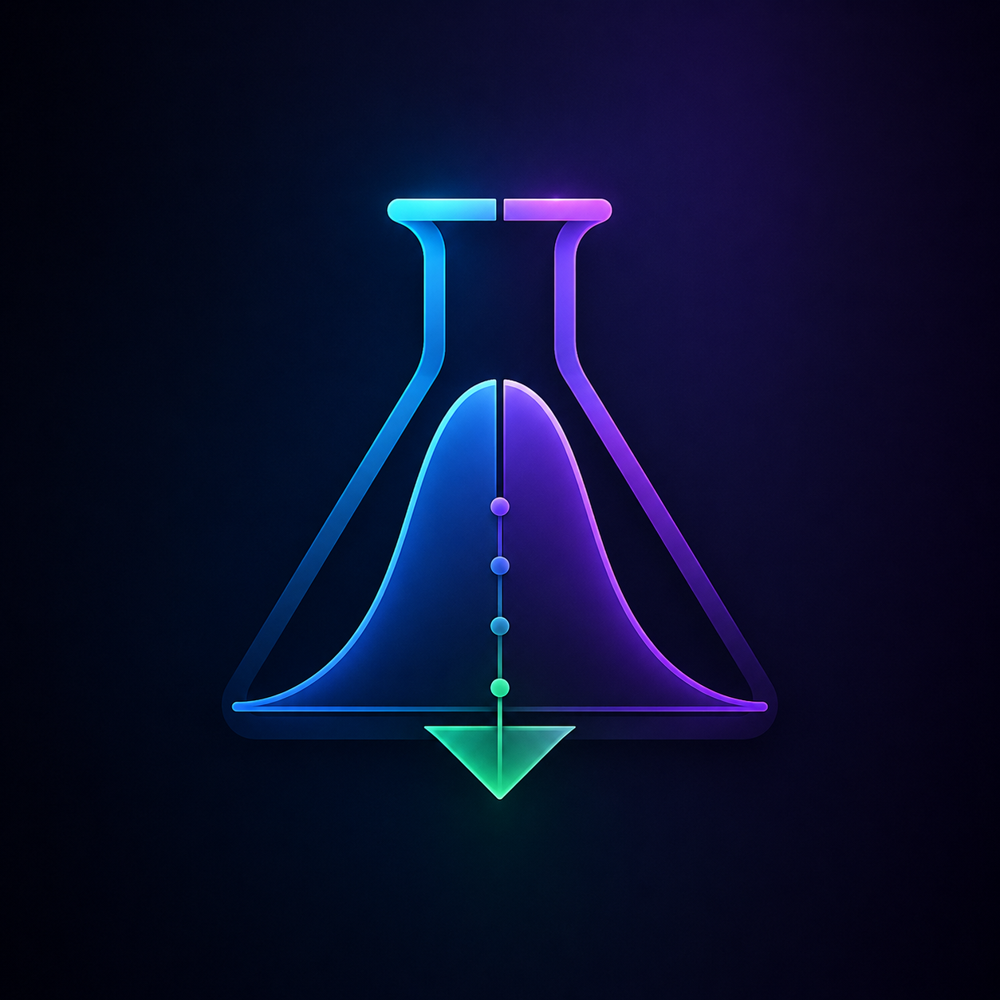

<div align="center">
  

  <h1>StatLab Experiments</h1>

  <p><strong>Planejamento e interpretação de testes A/B com Z-test, Bonferroni e decisão em 3 estados.</strong></p>
  <p><strong>Plan and interpret A/B tests with Z-test, Bonferroni correction and a 3-state decision engine.</strong></p>

  <p>
    <a href="#1-visão-geral--overview">PT-BR / English Overview</a> •
    <a href="#-product-preview">Preview</a> •
    <a href="#-stack--tecnologias">Stack</a> •
    <a href="#-arquitetura--architecture">Architecture</a> •
    <a href="#-quick-start--início-rápido">Quick Start</a> •
    <a href="#-autor--author">Author</a>
  </p>

  <p>
    
    
    
    
    
    
    
  </p>

  <p>
    <a href="https://frontend-gamma-blush-15.vercel.app">
      
    </a>
  </p>
</div>

---

## 1. Visão Geral / Overview

O **StatLab Experiments** é uma ferramenta web full-stack para **planejar e interpretar testes A/B** com rigor estatístico. Ele calcula tamanho amostral, executa Z-test para proporções com **correção de Bonferroni** e classifica o resultado em três estados: **Winner**, **Inconclusive** ou **Weak Effect**.

Diferente de um dashboard que só mostra “ganhou/perdeu”, o StatLab deixa explícitos o **alpha ajustado**, o **intervalo de confiança**, o **uplift** e a **interpretação textual** em português — útil para aprender inferência na prática e comunicar limitações com transparência.

O projeto foi desenvolvido por **Felipe Alirio Baruja** como peça de portfólio, unindo estatística frequentista aplicada e engenharia full-stack (Next.js + FastAPI no mesmo domínio Vercel).

> **Study / Simulation Notice**  
> O StatLab é um ambiente de estudo e demonstração. Ele **não** substitui uma plataforma de experimentação em produção, nem deve ser usado sozinho para decisões de rollout sem revisão metodológica.

---

## ✨ Product Preview

<p align="center">
  <a href="https://frontend-gamma-blush-15.vercel.app">
    <strong>Abrir demo ao vivo → https://frontend-gamma-blush-15.vercel.app</strong>
  </a>
</p>

A interface em PT-BR oferece:
- header com badges de stack e links para Portfólio / GitHub;
- botão **Carregar dados de demonstração** (fixture + pipeline automático);
- abas **Planejar** (tamanho amostral) e **Analisar** (Z-test + Bonferroni);
- gráfico comparativo A/B (Recharts);
- card de decisão com cores semânticas e relatório copiável.

Screenshots estáticos podem ser adicionados em `assets/screenshots/` (pasta já preparada).

---

## 2. Por que este projeto importa? / Why this project matters

* **Falsos positivos são caros:** múltiplas comparações sem correção inflacionam o Erro Tipo I. O StatLab expõe Bonferroni como input editável.
* **Significância ≠ impacto:** um efeito estatisticamente significativo pode ser pequeno demais para justificar rollout — daí o estado **Weak Effect**.
* **Amostra insuficiente é comum:** o módulo de planejamento usa Cohen's *h* + `NormalIndPower` para dimensionar o experimento antes de “olhar o p-value”.
* **Full-stack real:** frontend Next.js e API Python científica no **mesmo domínio** via Vercel Services — não é só um notebook estático.

---

## 🧠 O diferencial do StatLab / What makes StatLab different

### Português
O StatLab não é só um calculador. Ele combina planejamento amostral, inferência e comunicação de decisão em uma experiência única.

Ele mostra não apenas se o teste “passou”, mas também:
- qual alpha foi usado após Bonferroni;
- se o efeito absoluto é praticamente relevante;
- como o intervalo de confiança se comporta;
- o que acontece quando o número de comparações aumenta;
- um relatório textual pronto para copiar.

### English
StatLab is not just a calculator. It combines sample-size planning, inference and decision communication in one experience.

It shows not only whether a test “passed”, but also:
- which alpha was used after Bonferroni;
- whether the absolute effect is practically relevant;
- how the confidence interval behaves;
- what happens when the number of comparisons increases;
- a copy-ready textual report.

---

## 🎯 Problema que resolve / The problem it solves

Em ciclos reais de experimentação, decisões costumam falhar por:
- leitura superficial de uplift sem p-value / IC;
- ausência de correção para múltiplas hipóteses;
- confusão entre significância estatística e relevância prática;
- experimentos subdimensionados;
- relatórios inconsistentes entre produto, dados e engenharia.

O **StatLab Experiments** cria uma camada clara entre o cálculo estatístico e a interpretação acionável.

---

## 🧩 Proposta / Analytical Pipeline

```txt
Inputs de planejamento (baseline, MDE, alpha, power)
  ↓
Cohen's h + NormalIndPower → n por grupo
  ↓
Inputs de análise (visitantes/conversões A e B, alpha, n_comparisons)
  ↓
Z-test de proporções (statsmodels)
  ↓
alpha_adjusted = alpha / max(1, n_comparisons)  [Bonferroni]
  ↓
IC assintótico com z crítico ajustado
  ↓
Motor de decisão: Winner / Weak Effect / Inconclusive
  ↓
UI: gráfico + card colorido + relatório copiável
```

---

## ⚙️ Funcionalidades Principais / Core Features

### Planejar (sample size)
- Conversão base, MDE, alpha e poder.
- Cálculo de `n_per_group` com formatação `pt-BR`.
- Validação de inputs fora do domínio (0, 1).

### Analisar (Z-test + Bonferroni)
- Visitantes e conversões A/B.
- Alpha e número de comparações.
- Retorno de `p_value`, `uplift`, conversões, IC, `alpha_adjusted`, `status`, `interpretation`.

### Demo em um clique
- `GET /api/demo` popula o fixture e executa o pipeline completo.
- Caso padrão: 1000/50 vs 1000/74 → **Winner** com `n_comparisons = 1`.
- Com `n_comparisons = 5` o mesmo p-value vira **Inconclusive** (alpha ajustado 0.01).

### Motor de decisão (3 estados)
| Status | Critério |
|---|---|
| **Winner** | `p < alpha_adjusted` e `\|diff\| > 0.005` |
| **Weak Effect** | `p < alpha_adjusted` e `\|diff\| ≤ 0.005` |
| **Inconclusive** | `p ≥ alpha_adjusted` |

Cores semânticas na UI: verde `#16a34a`, âmbar `#d97706`, cinza `#64748b`.

---

## 🛠️ Stack / Tecnologias

### Frontend
- **Framework:** Next.js 16 (App Router) & React 19
- **Linguagem:** TypeScript
- **Estilização:** Tailwind CSS v4
- **Gráficos:** Recharts
- **Toasts / ícones:** Sonner, Lucide React

### Backend (serverless no mesmo deploy)
- **Framework API:** FastAPI (Python 3.12)
- **Validação:** Pydantic v2
- **Estatística:** SciPy + statsmodels + NumPy
- **Deploy:** Vercel Services (`web` + `api` no mesmo domínio)

---

## 🧱 Arquitetura / Architecture

Monorepo com app de produção em `frontend/` (root directory do Vercel):

```text
StatLab-Experiments/
├── frontend/
│   ├── api/
│   │   ├── index.py              # FastAPI (health, demo, sample-size, analyze)
│   │   └── requirements.txt
│   ├── app/
│   │   ├── page.tsx              # UI PT-BR (Planejar / Analisar)
│   │   ├── layout.tsx
│   │   └── globals.css
│   ├── requirements.txt
│   ├── vercel.json               # Vercel Services + rewrites públicos
│   └── package.json
│
├── backend/                      # Referência local histórica (não é o deploy Vercel)
├── docs/
│   ├── architecture-guardrails.md
│   ├── api-contract.md
│   └── capabilities.md
├── assets/
│   ├── icon.png
│   └── screenshots/              # (opcional) capturas para o README
├── portfolio-project-handoff.md
├── start.bat
└── README.md
```

### Arquitetura canônica de produção

- Projeto Vercel: **`frontend`**
- URL: https://frontend-gamma-blush-15.vercel.app
- Contrato da API: status em inglês (`Winner` / `Weak Effect` / `Inconclusive`), campo `alpha_adjusted`, fixture `analysis`
- **Não** usar `API_BACKEND_URL` nem projeto API paralelo para o demo ao vivo

Detalhes: [`docs/architecture-guardrails.md`](./docs/architecture-guardrails.md)

---

## 🔁 Data Flow Pipeline

```txt
Browser (same origin)
  ↓
GET  /api/health | /api/demo
POST /api/calculate-sample-size
POST /api/analyze
  ↓
FastAPI service (Vercel Services → api/index.py)
  ↓
SciPy / statsmodels
  ↓
JSON → UI (chart + decision card + copy report)
```

---

## 🚀 Quick Start / Início Rápido

### Pré-requisitos
- **Node.js** 20+ (recomendado 24)
- **Python** 3.12+
- **Git**
- Conta Vercel (para deploy)

### Opção 1 — Demo em produção
Abra: [https://frontend-gamma-blush-15.vercel.app](https://frontend-gamma-blush-15.vercel.app)

### Opção 2 — Frontend local + API em produção (rápido)
```bash
cd frontend
npm install
npm run dev
```
> Em desenvolvimento puro local, as rotas `/api/*` precisam do runtime Python (ex.: `vercel dev` a partir de `frontend/`).

### Opção 3 — Deploy
```bash
cd frontend
vercel --prod
```

---

## 🧪 Scripts e Validações / Scripts and Checks

```bash
cd frontend
npm run lint
npm run build
```

Smoke da API em produção (PowerShell):

```powershell
Invoke-RestMethod https://frontend-gamma-blush-15.vercel.app/api/health
Invoke-RestMethod https://frontend-gamma-blush-15.vercel.app/api/demo
```

---

## 📊 Metodologia Estatística / Statistical Methodology

- **Cohen's h + NormalIndPower:** dimensionamento amostral para proporções.
- **Z-test de duas proporções:** `statsmodels.stats.proportion.proportions_ztest`.
- **Bonferroni:** `alpha_adjusted = alpha / max(1, n_comparisons)`.
- **IC assintótico normal:** `z = norm.ppf(1 - alpha_adjusted/2)`.
- **Relevância prática:** limiar absoluto `|p_b - p_a| > 0.005` para separar Winner de Weak Effect.

Limitações conhecidas: IC assintótico (impreciso em amostras pequenas ou taxas perto de 0/1); apenas métricas de proporção; cold start Python no Vercel.

---

## 🧭 Roadmap

- [x] UI PT-BR + demo one-click
- [x] Bonferroni exposto na UI
- [x] Deploy unificado Next.js + FastAPI (Vercel Services)
- [ ] Testes automatizados (pytest / Vitest)
- [ ] Curva de poder
- [ ] Métricas contínuas
- [ ] Screenshots oficiais em `assets/screenshots/`

---

## 💼 Valor para Portfólio / Portfolio Value

O StatLab demonstra:
- **Estatística aplicada** com correção de múltiplas comparações e decisão não-binária;
- **API científica** em Python (SciPy / statsmodels) em produção serverless;
- **Frontend moderno** (Next.js 16 + TypeScript + Tailwind v4);
- **Deploy full-stack** no mesmo domínio, com contrato de API estável.

Portfólio: [barujafe.vercel.app](https://barujafe.vercel.app/)

---

## 📚 Documentação Complementar

- [`docs/architecture-guardrails.md`](./docs/architecture-guardrails.md) — regras canônicas de produção
- [`docs/api-contract.md`](./docs/api-contract.md) — contrato da API
- [`docs/capabilities.md`](./docs/capabilities.md) — capacidades
- [`portfolio-project-handoff.md`](./portfolio-project-handoff.md) — handoff completo

---

## 🔖 GitHub Repository Metadata

### About sugerido
```txt
Plan and interpret A/B tests with Z-test, Bonferroni correction and a 3-state decision engine (Winner / Inconclusive / Weak Effect).
```

### Topics sugeridos
```txt
ab-testing
statistics
bonferroni
fastapi
nextjs
typescript
python
scipy
statsmodels
vercel
portfolio-project
experimentation
sample-size
```

---

## 👤 Autor / Author

Desenvolvido por **Felipe Alirio Baruja**.

- **Portfolio:** [barujafe.vercel.app](https://barujafe.vercel.app/)
- **GitHub:** [@BarujaFe1](https://github.com/BarujaFe1)
- **LinkedIn:** [Gustavo Felipe Alirio Baruja](https://www.linkedin.com/in/barujafe/)
- **Live demo:** [frontend-gamma-blush-15.vercel.app](https://frontend-gamma-blush-15.vercel.app)

---

## 📄 Licença / License

MIT License. Copyright (c) 2026 Felipe Alirio Baruja.
